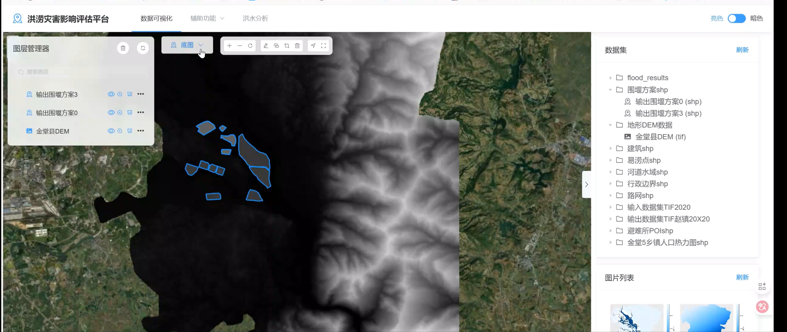
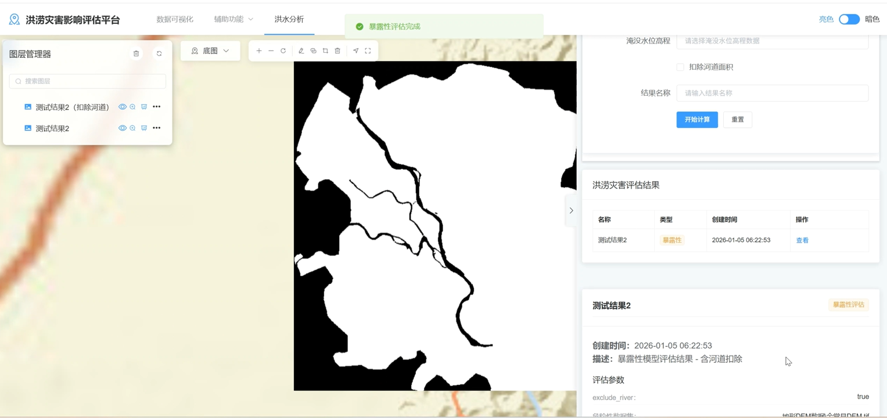

# 洪涝灾害影响评估平台 (Flood Assessment Platform)

## 项目简介 (Project Overview)
本项目是一个功能强大的洪涝灾害影响评估与数据可视化分析平台。通过结合地理信息系统（GIS）数据（如DEM高程数据、矢量建筑、易涝点、人口热力图等），平台能够进行精准的洪涝风险评估、水文模型分析、危险性与暴露性评估。

平台分为前端和后端两部分：
- **后端**：基于 Python/Flask 开发，提供栅格/矢量数据处理、空间分析、行列对齐、相关性分析等核心计算能力。
- **前端**：基于 Vue.js 开发，提供直观的地图交互、图层管理、多维度数据可视化及评估结果展示。

## 核心功能 (Key Features)
1. **多源数据管理与可视化**：支持加载和渲染 TIFF 栅格数据、SHP 矢量数据。
2. **洪涝灾害模型计算**：支持基于水位的淹没深度计算、危险性模型（Hazard Model）分析。
3. **暴露性与影响评估**：基于建筑物、人口热力图及避难所等数据，评估洪涝发生时的区域暴露性与综合影响。
4. **栅格与矢量工具**：内置影像对比、行列对齐、统计分析、相关性分析等丰富工具箱。
5. **评估结果导出**：支持结果数据导出为 CSV 等格式供进一步研究使用。

## 效果图展示 (Screenshots)

### 效果图1：平台图层管理与底图交互

### 效果图2：洪水分析与暴露性评估结果

## 开源与商用声明 (License & Usage Terms)
本项目已开源至 GitHub，欢迎学习与交流。

**关于商业使用的特别声明**：
1. **允许原版商用**：您可以将本项目的**未修改版本**直接用于商业目的。
2. **修改商用需授权**：如果您对本项目的源代码、UI界面或核心算法进行了**任何形式的修改**，并将其用于**商业用途（包括但不限于出售衍生软件、提供商业化SaaS服务、用于企业内部盈利项目等）**，**必须向原作者支付相应的授权费用**。

如需获取修改商用授权或有其他合作意向，请联系项目原作者。

## 快速开始 (Getting Started)
请参考项目中的 `installation_guide.md`（如适用）或以下基础步骤：
1. 配置后端 Python 运行环境并安装 `requirements.txt` 中的依赖。
2. 配置前端 Node.js 环境，在 `frontend` 目录下执行 `npm install` 及 `npm run serve`。
3. 将所需地理数据集放置于 `backend/data/` 目录。
